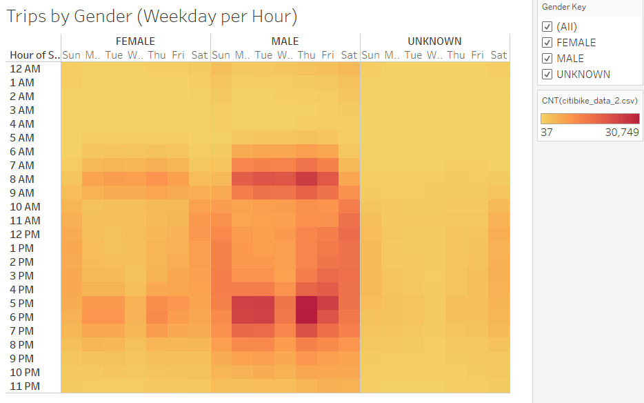
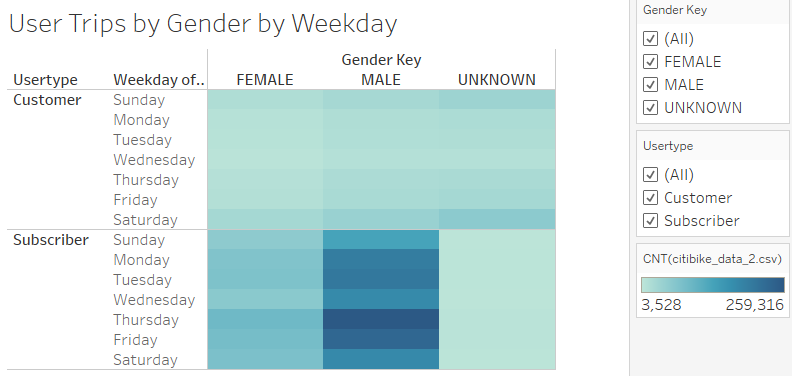

# NYC CitiBike Analysis
## Overview
### An analysis on the NYC CitiBike bikesharing program for the month of August has been conducted as part of the research for a proposed bikesharing program in Des Moines, Iowa. Through analyzing the usage statistics of CitiBike, investors and program developers can get a sense of how best to apply and utilize a bikesharing program in a new location.

## Resources
### Program:
- Tableau Public

### Data Source
- 201908-citibike-tripdata.csv

## Results

The NYC Citibike analysis visualizations have been compiled in a Tableau Story located [here](https://public.tableau.com/app/profile/alena.swann/viz/CitiBikeModule14Challenge/NYCCitiBikeUsageDetails?publish=yes).

### Bike Checkout Times For All Users

A heavy majority of bike checkouts are for less than one hour with the most common trip duration taking 5 minutes. 

### Bike Checkout Times By Gender

A large majority of these bikes are checked out by males; roughly more than three times the amount of bikes checked out by females. However, the trip duration is equivalent across all genders, peaking at 5-6 minutes.

### Top Starting Locations

The most utilized starting locations are densely-packed within a relatively small space, giving an indication of the types of attractions and locations that lend themselves to bike traffic/utilization.

### Top Ending Locations

The top ending locations correspond with the top starting locations, indicating the bikes are used for short-term travel within popular districts.

### Trips By Weekday Per Hour

This heatmap displays the array of trips taken each hour and each day of the week. Bike trips occurred the most between 7AM-9AM and 4PM-7PM Monday-Friday which corresponds with standard commuting times and "happy hours". Additionally, Saturdays and Sundays have popular usage times between 9AM and 7PM, corresponding with daytime activities that may be expected for tourism on weekends. This array sums up to 2,344,224 total of rides that occurred for August.

### Trips By Gender (Weekday per Hour)

The days and hours of bike utilization are consistent across genders, matching the general usage times of the overall users heatmap and displaying the same gender usage ratios mentioned previously, with males providing the majority of bikeshare participation.

### User Trips By Gender and Weekday

Males are the majority of subscribers to the CitiBike program. Bikesharing is utilized the most during the weekdays (especially Thursdays). However, non-subscribing customers utilize bikesharing more frequently on the weekends than during the week, potentially due to tourist usage. Non-subscribing customers are also more likely to not specify gender. 

## Summary
The NYC CitiBike bikesharing program has a high volume of users (2,344,224 users in August 2019). Their success can be attributed to multiple factors including a high number of subscribers and plenty of bikes available in popular areas for commuting and tourism needs. A heavy majority of bike trips are less than an hour, with most lasting only 5 minutes, indicating short-term transportation utilization. A majority of users are male, but bike usage days, times, and duration are equivalent across genders.

Additional visualizations for more insight can include:

- Adding 'Start Station Name' and 'End Station Name' to the text mark of the top starting locations map and top ending locations map, respectively, and then filtering the maps by 'Count' to view only the top 5-10 utilized locations. After acquiring these station names, the locations can be further researched for what makes them popular (local attractions, transit stations, etc.) and what makes the CitiBike station run smoothly (number of bikes, maintenance schedules, structural ease-of-use, etc.)
- Viewing the age distribution of CitiBike users by gender, which involves putting the count of rides in the Rows section, Birth Year in the Columns section, and adding Gender to the Color Mark. This is will give a line chart with a line for each gender and with peaks of the most common birth years among the users. Catering to the needs of the common age groups and looking into what may draw in less-common age groups could help with designing a successful business.

